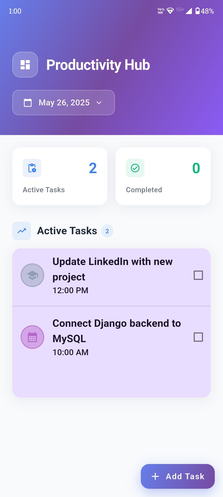
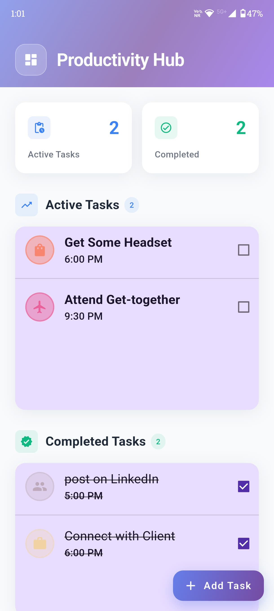
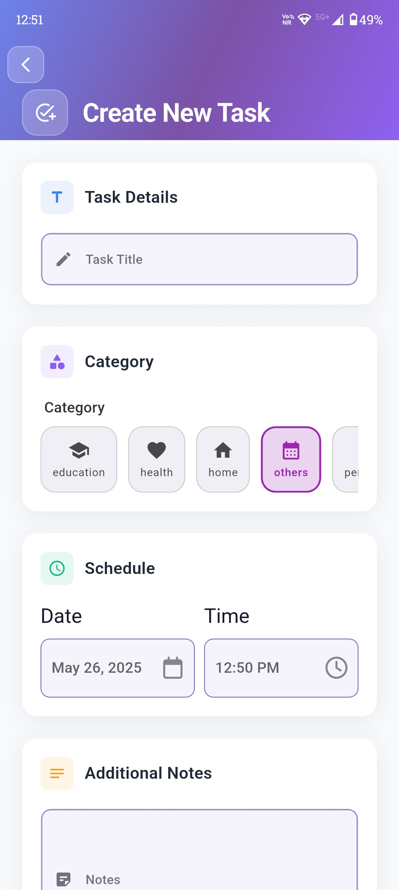
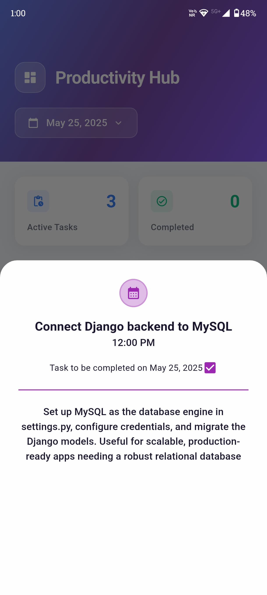

# 📋 Professional Todo App

  
  
  
  
  
  

  **A modern, professional Flutter todo application with elegant UI design and robust state management**

  [📱 Download Latest Release](https://github.com/SSaratchandraRaju/todo-app/releases/latest) • [🌐 Portfolio](https://saratchandra-raju-sarikonda.vercel.app/) • [💼 LinkedIn](https://www.linkedin.com/in/s-saratchandra-raju/)

---

## 🌟 Overview

This is a sophisticated, professional-grade Todo application built with Flutter, featuring a modern, elegant UI design and robust architecture. The app provides a seamless task management experience with intuitive navigation, beautiful animations, and comprehensive functionality.

## ✨ Features

### 🎨 **Modern Professional UI**
- **Gradient Design System**: Beautiful gradient backgrounds with glass-morphism effects
- **Card-Based Layout**: Clean, organized interface with subtle shadows and rounded corners
- **Responsive Design**: Optimized for various screen sizes and orientations
- **Custom Components**: Hand-crafted UI elements with consistent styling
- **Interactive Elements**: Smooth animations and hover effects

### 📊 **Task Management**
- **Create Tasks**: Add new tasks with title, category, date, time, and notes
- **Task Categories**: Organize tasks with customizable categories
- **Date Selection**: Built-in date picker for task scheduling
- **Time Management**: Set specific times for task completion
- **Task Completion**: Mark tasks as completed with visual feedback
- **Task Statistics**: Real-time overview of active and completed tasks

### 🗂️ **Organization Features**
- **Daily View**: Filter tasks by selected date
- **Category Filtering**: Organize tasks by different categories
- **Completion Tracking**: Separate views for active and completed tasks
- **Search & Filter**: Easy task discovery and management

### 💾 **Data Persistence**
- **Local Storage**: SQLite database for offline functionality
- **Data Integrity**: Robust data validation and error handling
- **Performance**: Optimized database queries and efficient data loading

## 🛠️ Technology Stack

### **Frontend Framework**
- **Flutter 3.0.6+**: Google's UI toolkit for cross-platform development
- **Dart**: Programming language optimized for mobile development

### **State Management**
- **Flutter Riverpod 2.3.6**: Reactive state management with dependency injection
- **Provider Pattern**: Clean separation of business logic and UI

### **Database & Storage**
- **SQLite**: Local database for data persistence
- **SQLite FFI**: Cross-platform SQLite implementation
- **Path Provider**: File system path management

### **UI & Design**
- **Material Design 3**: Modern Material Design components
- **Flex Color Scheme**: Advanced theming and color management
- **Google Fonts**: Beautiful typography with custom font integration
- **Font Awesome**: Comprehensive icon library
- **Gap**: Responsive spacing utility

### **Navigation & Routing**
- **Go Router 10.0.0**: Declarative routing with type-safe navigation
- **Deep Linking**: Support for URL-based navigation

### **Utilities**
- **Intl**: Internationalization and date formatting
- **Equatable**: Value equality for Dart objects

## 🏗️ Architecture Overview

### **Clean Architecture Approach**
The application follows modern Flutter development patterns:

- **Presentation Layer**: Professional UI with custom widgets and responsive design
- **Business Logic**: Riverpod state management with reactive programming
- **Data Layer**: SQLite database with efficient data operations
- **Navigation**: Go Router for type-safe, declarative routing

### **Design Patterns Used**
- **Provider Pattern**: Clean separation of business logic and UI
- **Repository Pattern**: Abstracted data access layer
- **Observer Pattern**: Reactive state updates with Riverpod
- **Singleton Pattern**: Shared app configurations and utilities

## 📱 Installation

### **Quick Install**
📥 **[Download the latest APK from GitHub Releases](https://github.com/your-username/todo-app/releases/latest)**

Simply download and install the APK file on your Android device to start using the app immediately.

## 📱 Screenshots

  
### 🏠 Home Screen - Dashboard View

*Modern dashboard with gradient header, task statistics, and organized task lists*

### 📊 Home Screen - Task Overview  

*Complete task overview with active and completed task sections*

### ➕ Add New Task

*Professional task creation form with category selection and scheduling*

### 📝 Task Details & Notes

*Detailed task view with notes and additional information*

## 🔧 Technical Implementation

This app demonstrates modern Flutter development practices and professional mobile app architecture:

### **State Management Logic**
- **Riverpod Providers**: Reactive state management with dependency injection
- **Consumer Widgets**: Efficient UI updates based on state changes
- **Provider Composition**: Modular and scalable state organization

### **Database Architecture**
- **SQLite Integration**: Local database for offline-first functionality
- **CRUD Operations**: Complete task lifecycle management
- **Data Persistence**: Reliable storage with proper error handling

### **UI Design System**
- **Material Design 3**: Modern design language implementation
- **Custom Color Schemes**: Professional gradient system
- **Responsive Layouts**: Adaptive UI for different screen sizes
- **Micro-interactions**: Smooth animations and user feedback

## 🔧 Development Approach

### **Code Quality & Best Practices**
- **Clean Code Principles**: Readable, maintainable architecture
- **SOLID Principles**: Object-oriented design implementation
- **Material Design 3**: Modern UI/UX standards
- **Performance Optimization**: Efficient rendering and memory management

### **Key Development Decisions**
- **Offline-First**: Local SQLite storage for reliability
- **Reactive Programming**: Riverpod for efficient state management  
- **Professional UI**: Custom design system with consistent theming
- **Cross-Platform**: Flutter for unified iOS and Android experience

## 📈 Future Enhancements

- [ ] **Cloud Synchronization**: Firebase integration for cross-device sync
- [ ] **Push Notifications**: Task reminders and deadline alerts
- [ ] **Theme Customization**: Multiple color schemes and dark mode
- [ ] **Data Export**: CSV/PDF export functionality
- [ ] **Task Sharing**: Collaborative task management
- [ ] **Analytics Dashboard**: Task completion statistics and insights

## 🤝 About This Project

This repository contains the compiled APK and documentation for the Professional Todo App. The application showcases modern Flutter development practices and serves as a demonstration of professional mobile app architecture.

### **Key Highlights**
- **Production-Ready**: Fully functional app ready for daily use
- **Professional Design**: Modern UI/UX with attention to detail  
- **Robust Architecture**: Scalable and maintainable code structure
- **Performance Optimized**: Smooth animations and efficient data handling

For any questions, feedback, or collaboration opportunities, feel free to reach out!

## 📄 License

This project is licensed under the MIT License - see the [LICENSE](LICENSE) file for details.

## 👨‍💻 Author

**Saratchandra Raju**

- 🌐 **Portfolio**: [saratchandra-raju-sarikonda.vercel.app](https://saratchandra-raju-sarikonda.vercel.app/)
- 💼 **LinkedIn**: [s-saratchandra-raju](https://www.linkedin.com/in/s-saratchandra-raju/)
- 📧 **Email**: [ssaratchandraraju@gmail.com](mailto:ssaratchandraraju@gmail.com)

---

  
⭐ Star this repository if you found it helpful!

  
Made with ❤️ using Flutter

